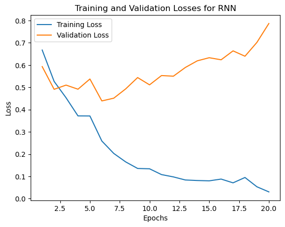
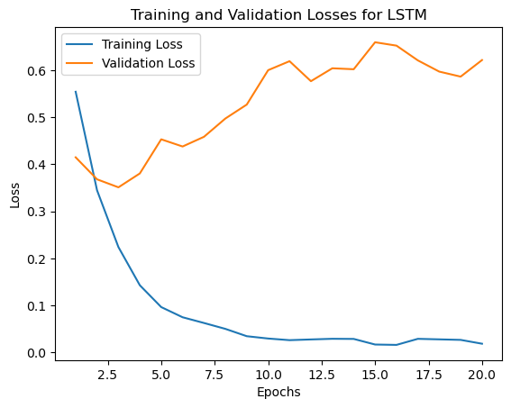

# Amazon Reviews Sentiment Analysis

This project aims to perform sentiment analysis on Amazon reviews using deep learning models like RNN and LSTM. The sentiment is classified into three categories: **positive**, **neutral**, and **negative**.

## Table of Contents
- [Project Overview](#project-overview)
- [Technologies Used](#technologies-used)
- [Setup and Installation](#setup-and-installation)
- [Data Preprocessing](#data-preprocessing)
- [Model Architecture](#model-architecture)
  - [Recurrent Neural Network (RNN)](#rnn-model)
  - [Long Short-Term Memory (LSTM)](#lstm-model)
- [Training the Models](#training-the-models)
- [Evaluation](#evaluation)
- [GUI for Sentiment Prediction](#gui-for-sentiment-prediction)
- [How to Use](#how-to-use)
- [License](#license)

## Project Overview

The goal of this project is to analyze and classify Amazon reviews based on their sentiment using deep learning techniques. The project focuses on text preprocessing, tokenization, and building models using Recurrent Neural Networks (RNN) and Long Short-Term Memory (LSTM).

## Technologies Used

- **Python 3.x**
- **Pandas**: For data manipulation and analysis.
- **NumPy**: For numerical computing.
- **Matplotlib & Seaborn**: For data visualization.
- **spaCy**: For text preprocessing and NLP tasks like tokenization and lemmatization.
- **PyTorch**: For building and training the RNN and LSTM models.
- **Keras**: For tokenization and sequence padding.
- **Tkinter**: For building a simple GUI for sentiment prediction.
- **Torch Optimizers**: For model optimization.

## Setup and Installation

1. Clone this repository.
   ```bash
   git clone https://github.com/your-repo-url

2. Install the required dependencies:
   ```bash
   pip install -r requirements.txt

3. Download and install the spaCy English model:
   ```bash
   python -m spacy download en_core_web_sm

4. Place your dataset (amazon_reviews.csv) in the Data folder.

## Data Preprocessing

- **Data Loading**: Load the Amazon reviews dataset using `pandas`.
- **Missing Value Handling**: Check for missing values and remove them.
- **Text Preprocessing**: Use `spaCy` to perform:
  - Tokenization
  - Lemmatization
  - Stopword and punctuation removal
  - Non-alphabetical character removal
- **Tokenization**: Use `Keras` tokenizer to convert words into sequences of tokens.
- **Padding**: Pad sequences to ensure uniform length for input to the models.

## Model Architecture

### RNN Model

The RNN model architecture consists of:

- Embedding layer
- Recurrent Neural Network (RNN) layer
- Dropout layer to prevent overfitting
- Fully connected output layer

### LSTM Model

The LSTM model architecture includes:

- Embedding layer
- Long Short-Term Memory (LSTM) layer
- Dropout layer
- Fully connected output layer

## Training the Models

The models are trained for 20 epochs using the Adam optimizer and CrossEntropyLoss. We perform training and validation over each epoch and evaluate the performance using accuracy and loss.

## Evaluation

After training, we visualize the training and validation losses across epochs for both the RNN and LSTM models to observe performance and check for overfitting or underfitting.

## GUI for Sentiment Prediction

A simple GUI is built using `tkinter`. Users can enter a review, choose between RNN and LSTM models, and the model will predict the sentiment (positive, neutral, or negative).

## Results

### RNN Model

- **Training Loss**: Shows a decreasing trend over epochs, indicating good learning progress.
- **Validation Loss**: Fluctuates but generally decreases, suggesting the model is learning but experiencing some overfitting in the later epochs.
- **Validation Accuracy**: Stabilizes around 86%, demonstrating reasonable performance for sentiment classification.

#### RNN Model Performance:

| Epoch | Train Loss | Val Loss | Val Accuracy |
|-------|------------|----------|--------------|
| 1     | 0.6675     | 0.5932   | 76.60%       |
| 2     | 0.5266     | 0.4911   | 80.30%       |
| 3     | 0.4532     | 0.5101   | 79.93%       |
| 4     | 0.3717     | 0.4916   | 81.85%       |
| 5     | 0.3714     | 0.5375   | 79.89%       |
| 6     | 0.2589     | 0.4390   | 84.96%       |
| 7     | 0.2031     | 0.4513   | 85.71%       |
| 8     | 0.1651     | 0.4931   | 86.76%       |
| 9     | 0.1357     | 0.5439   | 85.76%       |
| 10    | 0.1342     | 0.5112   | 85.99%       |
| ...   | ...        | ...      | ...          |
| 20    | 0.0305     | 0.7866   | 86.78%       |

#### RNN Performance Graphs:



---

### LSTM Model

- **Training Loss**: Decreases steadily, indicating effective learning.
- **Validation Loss**: Generally decreases, showing good generalization, although slight overfitting can be observed in later epochs.
- **Validation Accuracy**: Peaks around 89%, indicating superior performance compared to the RNN model.

#### LSTM Model Performance:

| Epoch | Train Loss | Val Loss | Val Accuracy |
|-------|------------|----------|--------------|
| 1     | 0.5543     | 0.4149   | 83.36%       |
| 2     | 0.3447     | 0.3681   | 86.23%       |
| 3     | 0.2239     | 0.3510   | 88.12%       |
| 4     | 0.1428     | 0.3805   | 88.18%       |
| 5     | 0.0963     | 0.4532   | 88.38%       |
| 6     | 0.0747     | 0.4379   | 89.23%       |
| 7     | 0.0625     | 0.4585   | 88.73%       |
| 8     | 0.0500     | 0.4974   | 89.60%       |
| 9     | 0.0344     | 0.5271   | 89.41%       |
| 10    | 0.0294     | 0.6002   | 89.46%       |
| ...   | ...        | ...      | ...          |
| 20    | 0.0184     | 0.6218   | 89.78%       |

#### LSTM Performance Graphs:


